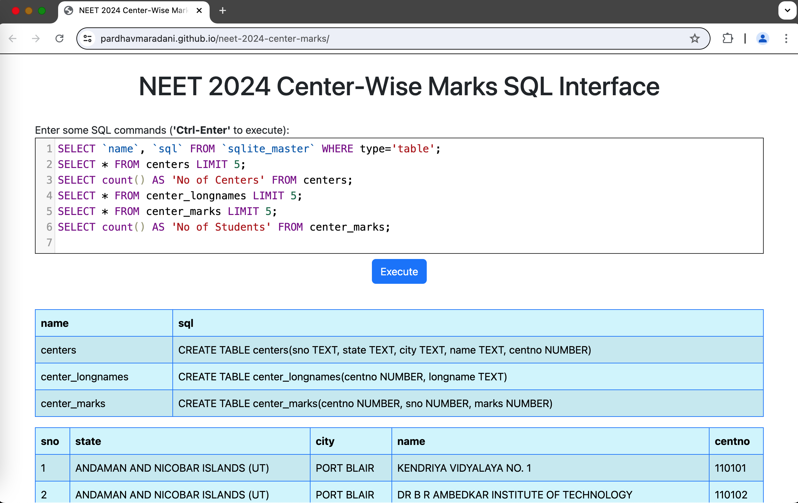
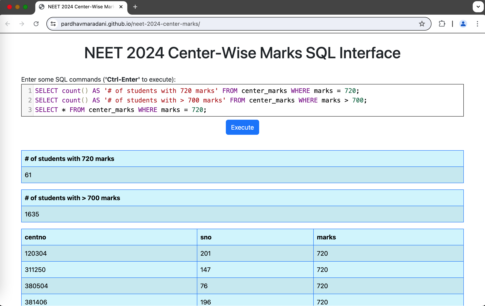

# NEET 2024 State / City / Center-Wise Marks Data Analysis

This is a browser based **SQL Interface** for NEET 2024 State / City / Center-Wise marks [data](https://neet.ntaonline.in/frontend/web/common-scorecard/index), which allows you to explore and analyze using **SQL** queries.

## Analyze

- Click [here](https://pardhavmaradani.github.io/neet-2024-center-marks/) to analyze this data in your browser
  - The Anaysis URL is https://pardhavmaradani.github.io/neet-2024-center-marks/
  - > Note that for the very first time, it could take a few seconds / minutes to download the database and set it up depending on your internet speed (The database file is ~38MB)
  - All queries work locally in your browser after that
- The web interface should look something like this:



- Enter your **SQL** commands in the textarea and click on the `Execute` button or `Ctrl-Enter` to see the results.



- The `db/neet-2024-center-marks-data.db` file can be downloaded and analyzed locally using `sqlite` as well
- All the CSV's of the data are available separately in the `csv` folder and can be analyzed in any spreadsheet tool

## About the data

- The centers data is obtained from the **NEET (UG) Result 2024 City/Center Wise** [link](https://neet.ntaonline.in/frontend/web/common-scorecard/index) as follows:
  - The page shows there are `4,750` entries in the bottom left

```
$ curl "https://neet.ntaonline.in/frontend/web/common-scorecard/getdataresult?draw=1&start=0&length=4750" -o neet-2024-centers.json
$ python -m json.tool neet-2024-centers.json > neet-2024-centers-pretty.json
```

- `neet-2024-centers.csv` file is generated based on the above JSON data
- `neet-2024-center-longnames.csv` and `neet-2024-center-marks.csv` files are generated by parsing individual center specific PDF files available as:
  - `https://neetfs.ntaonline.in/NEET_2024_Result/<centno>.pdf`
- `generate-data.js` has the source code to generate these CSV files
- An `sqlite` database `neet-2024-center-marks-data.db` is created as follows from these CSV files:

```
$ sqlite3
SQLite version 3.46.0 2024-05-23 13:25:27
Enter ".help" for usage hints.
Connected to a transient in-memory database.
Use ".open FILENAME" to reopen on a persistent database.
sqlite> .mode csv
sqlite> create table centers(sno TEXT, state TEXT, city TEXT, name TEXT, centno NUMBER);
sqlite> .import neet-2024-centers.csv centers
sqlite> select count(*) from centers;
4750
sqlite> create table center_longnames(centno NUMBER, longname TEXT);
sqlite> .import neet-2024-center-longnames.csv center_longnames
sqlite> select count(*) from center_longnames;
4750
sqlite> create table center_marks(centno NUMBER, sno NUMBER, marks NUMBER);
sqlite> .import neet-2024-center-marks.csv center_marks
sqlite> select count(*) from center_marks;
2333162
sqlite> .save neet-2024-center-marks-data.db
sqlite> 

$
```

- [sql.js](https://github.com/sql-js/sql.js) was used to create the SQL Web Interface

## Running locally

- To run a local version:
  - Clone this repo
  - Start a local server in the cloned folder using: `$ ./start_local_server.py`
  - Open `http://localhost:8081/` in your browser
