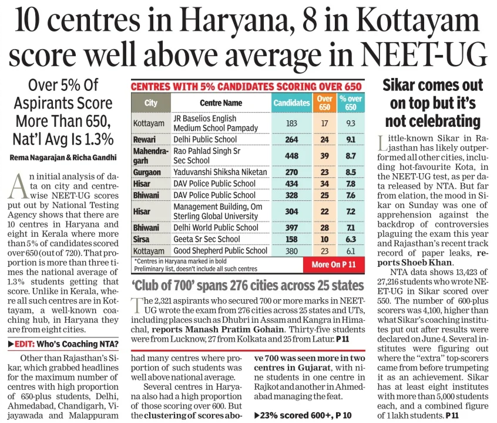

# NEET 2024 State / City / Center-Wise Marks Data Analysis

This is a browser based **SQL Interface** for NEET 2024 State / City / Center-Wise marks [data](https://neet.ntaonline.in/frontend/web/common-scorecard/index), which allows you to explore and analyze using **SQL** queries.

## Analyze

- Click [here](https://pardhavmaradani.github.io/neet-2024-center-marks/) to analyze this data in your browser
  - The Anaysis URL is https://pardhavmaradani.github.io/neet-2024-center-marks/
  - > Note that for the very first time, it could take a few seconds / minutes to download the database and set it up depending on your internet speed (The database file is ~38MB)
  - All queries work locally in your browser after that
- The web interface should look something like this:


- Enter your **SQL** commands in the textarea and click on the `Execute` button or `Ctrl-Enter` to see the results.


- The `db/neet-2024-center-marks-data.db` file can be downloaded and analyzed locally using `sqlite` as well
- All the CSV's of the data are available separately in the `csv` folder and can be analyzed in any spreadsheet tool

## About the data

- The centers data is obtained from the **NEET (UG) Result 2024 City/Center Wise** [link](https://neet.ntaonline.in/frontend/web/common-scorecard/index) as follows:
  - The page shows there are `4,750` entries in the bottom left

```
$ curl "https://neet.ntaonline.in/frontend/web/common-scorecard/getdataresult?draw=1&start=0&length=4750" -o neet-2024-centers.json
$ python -m json.tool neet-2024-centers.json > neet-2024-centers-pretty.json
```

- `neet-2024-centers.csv` file is generated based on the above JSON data
- `neet-2024-center-longnames.csv` and `neet-2024-center-marks.csv` files are generated by parsing individual center specific PDF files available as:
  - `https://neetfs.ntaonline.in/NEET_2024_Result/<centno>.pdf`
- `generate-data.js` has the source code to generate these CSV files
- An `sqlite` database `neet-2024-center-marks-data.db` is created as follows from these CSV files:

```
$ sqlite3
SQLite version 3.46.0 2024-05-23 13:25:27
Enter ".help" for usage hints.
Connected to a transient in-memory database.
Use ".open FILENAME" to reopen on a persistent database.
sqlite> .mode csv
sqlite> create table centers(sno TEXT, state TEXT, city TEXT, name TEXT, centno NUMBER);
sqlite> .import neet-2024-centers.csv centers
sqlite> select count(*) from centers;
4750
sqlite> create table center_longnames(centno NUMBER, longname TEXT);
sqlite> .import neet-2024-center-longnames.csv center_longnames
sqlite> select count(*) from center_longnames;
4750
sqlite> create table center_marks(centno NUMBER, sno NUMBER, marks NUMBER);
sqlite> .import neet-2024-center-marks.csv center_marks
sqlite> select count(*) from center_marks;
2333162
sqlite> .save neet-2024-center-marks-data.db
sqlite> 

$
```

- [sql.js](https://github.com/sql-js/sql.js) was used to create the SQL Web Interface

## Running locally

- To run a local version:
  - Clone this repo
  - Start a local server in the cloned folder using: `$ ./start_local_server.py`
  - Open `http://localhost:8081/` in your browser

## Writing / Generating SQL Queries

I am still new to SQL and only know basic querying.  One of the fun ways I found to both learn and explore SQL queries is using [ChatGPT](https://chatgpt.com).

For example, Times of India (TOI) had a front page article with the analysis of the center-wise marks data released by NTA on the 22nd of July 2024 - the snippet of it can be seen below:



I wanted to verify the data in the main table above and other pieces of data mentioned in the article with this SQL Interface.

I first provided my table data to ChatGPT as follows:

> My database has three tables. 'centers' is a table that has center information.  The columns in 'centers' are 'sno', which is the serial number of the center, 'state', which is the state in which the center is located, 'city' is the city where the center is located, 'name' is the name of the center and 'centno' is the center number. 'center_longnames' is a table that has long names of the centers.  The columns in 'center_longnames' are 'centno', which is the center number and 'longname', which is the long name of the center. 'center_marks' is a table which has the candidate marks in centers.  The columns in 'center_marks' are 'centno', which is the center number, 'sno', which is the serial number of a candidate and 'marks' is the candidate marks.

I asked for the SQL query for the `Centre's with 5% candidates scoring over 650` as follows:

> Generate a query to show the state, city, center name, number of candidates in that center, number of candidates over 650 marks and the percentage of candidates over 650 marks ordered by the percentage in descending order and for percentage greater than 5% and rounded to 1 place

ChatGPT provided the following SQL query:

```
SELECT 
    c.state,
    c.city,
    c.name AS center_name,
    COUNT(cm.sno) AS total_candidates,
    COUNT(CASE WHEN cm.marks > 650 THEN 1 END) AS candidates_over_650,
    ROUND((COUNT(CASE WHEN cm.marks > 650 THEN 1 END) * 100.0 / COUNT(cm.sno)), 1) AS percentage_over_650
FROM 
    centers c
JOIN 
    center_marks cm ON c.centno = cm.centno
GROUP BY 
    c.state, c.city, c.name
HAVING 
    ROUND((COUNT(CASE WHEN cm.marks > 650 THEN 1 END) * 100.0 / COUNT(cm.sno)), 1) > 5
ORDER BY 
    percentage_over_650 DESC;
```

Though TOI showed only a partial table (and entries without `SIKAR`), the full table can be seen in our SQL Interface as shown here:

<details open>
  <summary>Click here to show / hide the table</summary>

```
┌────────────────┬──────────────┬───────────────────────────────────────────────────────────┬──────────────────┬─────────────────────┬─────────────────────┐
│     state      │     city     │                        center_name                        │ total_candidates │ candidates_over_650 │ percentage_over_650 │
├────────────────┼──────────────┼───────────────────────────────────────────────────────────┼──────────────────┼─────────────────────┼─────────────────────┤
│ OUTSIDE-INDIA  │ BANGKOK      │ GLOBAL INDIAN INTERNATIONAL SCHOOL                        │ 8                │ 1                   │ 12.5                │
│ RAJASTHAN      │ SIKAR        │ TAGORE P.G. COLLEGE                                       │ 356              │ 44                  │ 12.4                │
│ RAJASTHAN      │ SIKAR        │ YASH PUBLIC SR. SEC. SCHOOL                               │ 358              │ 37                  │ 10.3                │
│ KERALA         │ KOTTAYAM     │ JR BASELIOS ENG MED SCH PAMPADY (S) KOTTAYAM KL           │ 183              │ 17                  │ 9.3                 │
│ RAJASTHAN      │ SIKAR        │ SWAMI NITYANAND SR. SEC. SCHOOL                           │ 475              │ 44                  │ 9.3                 │
│ RAJASTHAN      │ SIKAR        │ D.A.V. PUBLIC SHIKSHAN SANSTHAN SR. SEC. SCHOOL           │ 502              │ 46                  │ 9.2                 │
│ RAJASTHAN      │ SIKAR        │ DANTA MAHAVIDHALAYA                                       │ 425              │ 39                  │ 9.2                 │
│ RAJASTHAN      │ SIKAR        │ SOBHASARIA GROUP OF INSTITUTIONS                          │ 502              │ 46                  │ 9.2                 │
│ HARYANA        │ REWARI       │ DELHI PUBLIC SCHOOL, REWARI                               │ 264              │ 24                  │ 9.1                 │
│ RAJASTHAN      │ SIKAR        │ VARDA SMART SCHOOL                                        │ 714              │ 64                  │ 9.0                 │
│ RAJASTHAN      │ SIKAR        │ SARASWATI VIDHYA MANDIR SR SEC SCHOOL                     │ 380              │ 34                  │ 8.9                 │
│ RAJASTHAN      │ SIKAR        │ NEW CENTRAL ACADEMY CHHAWANI NEEMKATHANA                  │ 351              │ 31                  │ 8.8                 │
│ HARYANA        │ MAHENDRAGARH │ RAO PAHLAD SINGH SR SEC SCHOOL                            │ 448              │ 39                  │ 8.7                 │
│ RAJASTHAN      │ SIKAR        │ GURUKUL INTERNATIONAL SCHOOL                              │ 715              │ 62                  │ 8.7                 │
│ RAJASTHAN      │ SIKAR        │ MAHATMA GANDHI INT. SCHOOL                                │ 703              │ 61                  │ 8.7                 │
│ RAJASTHAN      │ SIKAR        │ SANSKAR BALIKA P.G. COLLEGE                               │ 429              │ 37                  │ 8.6                 │
│ HARYANA        │ GURUGRAM     │ YADUVANSHI SHIKSHA NIKETAN                                │ 271              │ 23                  │ 8.5                 │
│ RAJASTHAN      │ SIKAR        │ ASHA ACADEMY                                              │ 355              │ 30                  │ 8.5                 │
│ RAJASTHAN      │ SIKAR        │ SHRI ARJUNRAM MAHAVIDHYALAYA                              │ 404              │ 34                  │ 8.4                 │
│ RAJASTHAN      │ SIKAR        │ SHRI BHAGWANDAS TODI COLLEGE                              │ 597              │ 50                  │ 8.4                 │
│ RAJASTHAN      │ SIKAR        │ PINK PEARL SHIKSHAN SANSTHAN SR. SEC. SCHOOL              │ 502              │ 41                  │ 8.2                 │
│ RAJASTHAN      │ SIKAR        │ BHARAT RAJ P G COLLEGE                                    │ 356              │ 29                  │ 8.1                 │
│ RAJASTHAN      │ SIKAR        │ SARASWATI PUBLIC SCHOOL                                   │ 357              │ 29                  │ 8.1                 │
│ RAJASTHAN      │ SIKAR        │ GOENKA PUBLIC SCHOOL                                      │ 476              │ 38                  │ 8.0                 │
│ RAJASTHAN      │ SIKAR        │ SVP SHIKSHAN AVAM ANUSANDHAN SANSTHAN                     │ 477              │ 38                  │ 8.0                 │
│ RAJASTHAN      │ SIKAR        │ MODY INSTITUTE OF TECHNOLOGY                              │ 668              │ 53                  │ 7.9                 │
│ RAJASTHAN      │ SIKAR        │ POLKAJI SHIKSHAN SANSTHAN                                 │ 429              │ 34                  │ 7.9                 │
│ HARYANA        │ HISSAR       │ DAV POLICE PUBLIC SCHOOL                                  │ 434              │ 34                  │ 7.8                 │
│ RAJASTHAN      │ SIKAR        │ ARYAN PG COLLEGE                                          │ 501              │ 39                  │ 7.8                 │
│ RAJASTHAN      │ SIKAR        │ KENDRIYA VIDYALAYA SIKAR                                  │ 474              │ 37                  │ 7.8                 │
│ RAJASTHAN      │ SIKAR        │ SHRI MANGAL CHAND DIDWANIYA VIDYA MANDIR (RBSE)           │ 574              │ 44                  │ 7.7                 │
│ HARYANA        │ BHIWANI      │ DAV POLICE PUBLIC SCHOOL                                  │ 328              │ 25                  │ 7.6                 │
│ RAJASTHAN      │ SIKAR        │ VIDYA NIKETAN SR. SEC. SCHOOL                             │ 471              │ 36                  │ 7.6                 │
│ RAJASTHAN      │ SIKAR        │ SHRI BALAJI COLLEGE                                       │ 716              │ 54                  │ 7.5                 │
│ RAJASTHAN      │ SIKAR        │ SGR PUBLIC SCHOOL                                         │ 447              │ 33                  │ 7.4                 │
│ RAJASTHAN      │ SIKAR        │ SUNRISE INTERNATIONAL PUBLIC SCHOOL                       │ 592              │ 44                  │ 7.4                 │
│ RAJASTHAN      │ SIKAR        │ TAJ GLOBAL ACADEMY                                        │ 714              │ 53                  │ 7.4                 │
│ TAMIL NADU     │ NAMAKKAL     │ THE SPECTRUM ACADEMY                                      │ 565              │ 41                  │ 7.3                 │
│ HARYANA        │ HISSAR       │ MANAGEMENT BUILDING, OM STERLING GLOBAL UNIVERSITY, HISAR │ 304              │ 22                  │ 7.2                 │
│ RAJASTHAN      │ SIKAR        │ SATYAM PUBLIC SR. SEC. SCHOOL                             │ 428              │ 31                  │ 7.2                 │
│ TAMIL NADU     │ NAMAKKAL     │ EXCEL ENGINEERING COLLEGE                                 │ 469              │ 34                  │ 7.2                 │
│ HARYANA        │ BHIWANI      │ DELHI WORLD PUBLIC SCHOOL                                 │ 397              │ 28                  │ 7.1                 │
│ RAJASTHAN      │ SIKAR        │ BHARTIYA MAHILA P.G. MAHAVIDYALAYA                        │ 500              │ 35                  │ 7.0                 │
│ RAJASTHAN      │ SIKAR        │ MAHATMA GANDHI P.G. COLLEGE                               │ 713              │ 50                  │ 7.0                 │
│ TAMIL NADU     │ NAMAKKAL     │ KURINJI SCH KAVETTIPATTY VALLIPURAM NAMAKKAL TN           │ 687              │ 48                  │ 7.0                 │
│ RAJASTHAN      │ JHUNJHUNU    │ KENDRIYA VIDYALAYA JHUJHUNU                               │ 389              │ 27                  │ 6.9                 │
│ RAJASTHAN      │ KOTA         │ OM KOTHARI INSTITUTE OF MANAGEMENT                        │ 519              │ 36                  │ 6.9                 │
│ RAJASTHAN      │ SIKAR        │ CHOUDHARY GHARSIRAM PUBLIC SCHOOL                         │ 383              │ 26                  │ 6.8                 │
│ RAJASTHAN      │ SIKAR        │ SWAMI NITYANAND INTERNATIONAL ACADEMY                     │ 592              │ 40                  │ 6.8                 │
│ RAJASTHAN      │ SIKAR        │ SHRI MADAN LAL BALIKA UCCH MADHYAMIK ADARSH VIDYA MANDIR  │ 285              │ 19                  │ 6.7                 │
│ RAJASTHAN      │ SIKAR        │ SHRI MANGAL CHAND DIDWANIYA VIDYA MANDIR (CBSE)           │ 716              │ 48                  │ 6.7                 │
│ RAJASTHAN      │ SIKAR        │ VINAYAK SR. SEC. SCHOOL                                   │ 476              │ 31                  │ 6.5                 │
│ RAJASTHAN      │ SIKAR        │ BPS CONVENT SCHOOL                                        │ 714              │ 46                  │ 6.4                 │
│ RAJASTHAN      │ SIKAR        │ VIDYA BHARATI PUBLIC SCHOOL                               │ 1001             │ 64                  │ 6.4                 │
│ HARYANA        │ SIRSA        │ GEETA SR. SEC. SCHOOL                                     │ 158              │ 10                  │ 6.3                 │
│ RAJASTHAN      │ SIKAR        │ SINGHANIA GLOBAL ACADEMY                                  │ 708              │ 44                  │ 6.2                 │
│ RAJASTHAN      │ SIKAR        │ SEM SCHOOL NEEMKATHANA                                    │ 474              │ 29                  │ 6.1                 │
│ KERALA         │ KOTTAYAM     │ GOOD SHEPHERD PUBLIC SCHOOL                               │ 381              │ 23                  │ 6.0                 │
│ RAJASTHAN      │ KOTA         │ KAUTILYA SR. SEC. SCHOOL                                  │ 566              │ 34                  │ 6.0                 │
│ RAJASTHAN      │ SIKAR        │ SOBHASARIA COLLEGE                                        │ 503              │ 30                  │ 6.0                 │
│ RAJASTHAN      │ JHUNJHUNU    │ JB SHAH GIRLS (PG) COLLEGE                                │ 422              │ 25                  │ 5.9                 │
│ TAMIL NADU     │ NAMAKKAL     │ THE NAVODAYA ACADEMY SENIOR SECONDARY SCHOOL              │ 659              │ 39                  │ 5.9                 │
│ GUJARAT        │ RAJKOT       │ UNIT-1 SCHOOL OF ENGINEERING R.K.UNIVERSITY               │ 1968             │ 110                 │ 5.6                 │
│ RAJASTHAN      │ JHUNJHUNU    │ JK MODI GOVT GIRLS SR SEC SCHOOL                          │ 378              │ 21                  │ 5.6                 │
│ RAJASTHAN      │ KOTA         │ BHUVNESH BAL VIDYALAYA                                    │ 502              │ 28                  │ 5.6                 │
│ RAJASTHAN      │ SIKAR        │ BAGARIA BAL VIDYA NIKETAN                                 │ 284              │ 16                  │ 5.6                 │
│ HARYANA        │ KARNAL       │ ST THERESA`S CONVENT SCHOOL KARNAL                        │ 472              │ 26                  │ 5.5                 │
│ KERALA         │ KOTTAYAM     │ AKM PUBLIC SCHOOL                                         │ 455              │ 25                  │ 5.5                 │
│ KERALA         │ KOTTAYAM     │ BMM ENG MED SCHOOL                                        │ 380              │ 21                  │ 5.5                 │
│ RAJASTHAN      │ CHURU        │ GOPIRAM GOENKA GOVT SEN SEC SCHOOL CHURU                  │ 310              │ 17                  │ 5.5                 │
│ KERALA         │ KOTTAYAM     │ CHAVARA PUBLIC SCHOOL PALA PO KOTTAYAM KERALA             │ 680              │ 37                  │ 5.4                 │
│ KERALA         │ KOTTAYAM     │ MARY MOUNT PUBLIC SCHOOL                                  │ 670              │ 36                  │ 5.4                 │
│ RAJASTHAN      │ BIKANER      │ SAHEED MAJOR JAMES THOMAS GOVT. SR. SEC. SCHOOL (GOVT.)   │ 351              │ 19                  │ 5.4                 │
│ RAJASTHAN      │ BIKANER      │ SETH TOLARAM BAFNA ACADEMY NOKHA RD BIKANER RAJ           │ 569              │ 30                  │ 5.3                 │
│ RAJASTHAN      │ BIKANER      │ BJS RAMPURIA JAIN LAW COLLEGE                             │ 524              │ 27                  │ 5.2                 │
│ RAJASTHAN      │ KOTA         │ GURU NANAK PUBLIC SCHOOL                                  │ 499              │ 26                  │ 5.2                 │
│ ANDHRA PRADESH │ TANUKU       │ SREE RAMA INSTITUTE OF MANAGEMENT ( MBA)                  │ 214              │ 11                  │ 5.1                 │
│ HARYANA        │ KURUKSHETRA  │ WISDOM WORLD SCHOOL                                       │ 467              │ 24                  │ 5.1                 │
│ KERALA         │ KOTTAYAM     │ SACRED HEART PUBLIC SCHOOL KILIMALA                       │ 491              │ 25                  │ 5.1                 │
│ TAMIL NADU     │ NAMAKKAL     │ NATIONAL PUBLIC SCHOOL                                    │ 589              │ 30                  │ 5.1                 │
└────────────────┴──────────────┴───────────────────────────────────────────────────────────┴──────────────────┴─────────────────────┴─────────────────────┘
```

</details>

There is also an error in the TOI article about the number of candidates who scored over 550 in Sikar.

The article states:

> NTA data shows 13,423 of 27,216 students who wrote NEET-UG in Sikar scored over 550.

The ChatGPT prompt used for this data is:

> Generate a query that that shows the total number of candidates and the number of candidates who scored over 550 in SIKAR

The SQL query that ChatGPT showed is:

```
SELECT 
    COUNT(cm.sno) AS total_candidates,
    SUM(CASE WHEN cm.marks > 550 THEN 1 ELSE 0 END) AS candidates_over_550
FROM 
    centers c
JOIN 
    center_marks cm ON c.centno = cm.centno
WHERE 
    c.city = 'SIKAR';
```

Our SQL Interface shows:

```
┌──────────────────┬─────────────────────┐
│ total_candidates │ candidates_over_550 │
├──────────────────┼─────────────────────┤
│ 27216            │ 6291                │
└──────────────────┴─────────────────────┘

```

As we can see, the 27,216 number is correct, but the 13,423 number that the article states is way off (and incorrect).

To check the national average % for candidates scoring over 650 in a center:

ChatGPT prompt:

> Generate a query that shows the average percentage of candidates who scored over 650 across all centers

SQL that ChatGPT generated:

```
WITH CenterPercentages AS (
    SELECT 
        c.centno,
        ROUND((SUM(CASE WHEN cm.marks > 650 THEN 1 ELSE 0 END) * 100.0) / COUNT(cm.sno), 1) AS percentage_over_650
    FROM 
        centers c
    JOIN 
        center_marks cm ON c.centno = cm.centno
    GROUP BY 
        c.centno
)
SELECT 
    ROUND(AVG(percentage_over_650), 1) AS avg_percentage_over_650
FROM 
    CenterPercentages;
```

SQL Interface output:

```
┌─────────────────────────┐
│ avg_percentage_over_650 │
├─────────────────────────┤
│ 1.2                     │
└─────────────────────────┘
```

In addition all other data in pages 10 and 11 of that edition can also be easily verified using this SQL Interface.

SQL, which is a universal language thus provides a great way to explore and analyze this data.  Ideally an integrated interface with a GPT would have made this very user friendly for those not familiar or experts at SQL.

